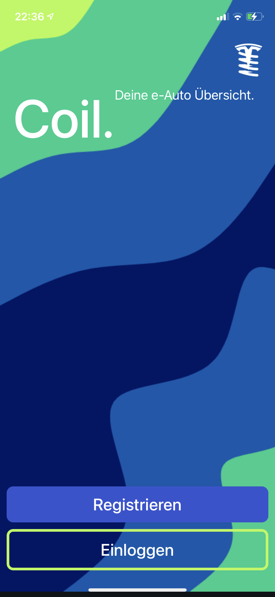
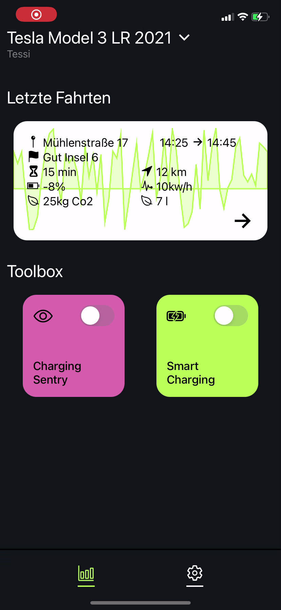

# Coil - Ein Tesla Data Logger
> WIP

Coil ermöglicht es, Daten von Tesla-Fahrzeugen zu erfassen und zu analysieren. Mit Coil können Sie Ihre Fahrleistung, Ihre Energienutzung und andere wichtige Daten verfolgen. Sie können Ihre Daten auch mit anderen Tesla-Besitzern teilen oder sie mit anderen Anwendungen verwenden, wie z. B. Flottenmanagement- oder Navigationssystemen.

# Screenshots

